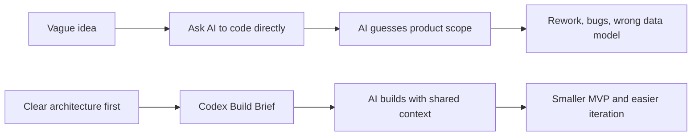
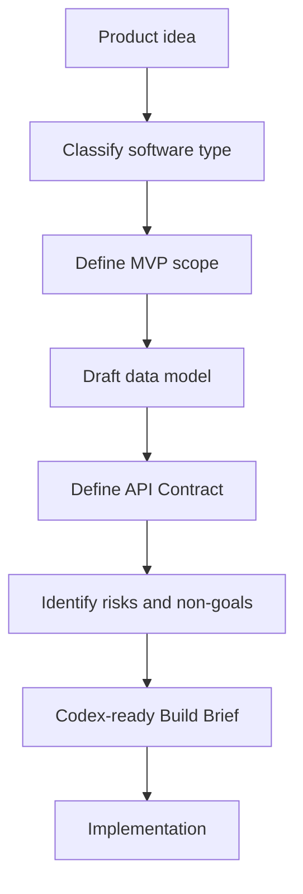

# vibe-coding-architecture-skill

[](LICENSE)
[](SKILL.md)
[](docs/usage.md)
[](https://github.com/ziguishian/vibe-coding-architecture-skill/stargazers)

A beginner-friendly software architecture advisor skill for Codex and AI coding agents.

> **Architecture before implementation.**
>
> The first step of AI Coding is not generating code. The first step is defining the system.

> Other README languages:
> [中文](README.md) · [简体中文](README.zh-CN.md) · [日本語](README.ja-JP.md) · [한국어](README.ko-KR.md)

## What This Skill Is

`vibe-coding-architecture-skill` helps users clarify software architecture before asking Codex or another AI coding agent to write code.

It is a Skill and documentation repository, not a framework, npm package, Python package, or code generator.

## Who It Is For

- Beginners who want to build a website, app, SaaS, AI tool, dashboard, automation workflow, or MVP
- Indie hackers and creators who have product ideas but not architecture documents
- Codex users who want better prompts before implementation
- Maintainers who want reusable architecture consultation templates

## Why Architecture Matters Before AI Coding

AI coding often fails when the system is undefined. The model may write valid code, but for the wrong product shape.



Before coding, clarify:

- Product type
- Target users
- MVP scope
- User roles
- Data model
- Page and screen structure
- API Contract
- Error states
- Permission rules
- File storage
- AI or third-party integrations
- Deployment strategy
- Cost risks
- Upgrade path

## What Problems It Solves

- Turns vague product ideas into clear architecture plans
- Prevents over-engineering in first versions
- Helps beginners understand technical choices
- Produces Codex-ready Build Briefs
- Creates a shared language between human users and AI coding agents

## Architecture-first Comparison



## File Structure

```text
.
├── SKILL.md
├── README.md
├── README.en-US.md
├── README.zh-CN.md
├── README.ja-JP.md
├── README.ko-KR.md
├── docs/
├── references/
├── examples/
└── evals/
```

## How to Use

1. Read `SKILL.md` to understand the Skill behavior.
2. Copy this repository into your Codex Skill directory, or use it as a reference repository.
3. Before asking Codex to build, ask for an architecture recommendation.
4. Review the generated Codex Build Brief.
5. Start implementation only after the architecture is clear.

## Example Prompts

```text
I want to build an AI SaaS for generating marketing copy. Please plan the architecture before coding.
```

```text
我想做一个小红书内容生成工具，先帮我做软件架构规划。
```

```text
Help me decide the MVP architecture for a local desktop prompt manager.
```

## Supported Project Types

- Static website
- Content website
- Login-based web app
- SaaS
- Admin dashboard
- E-commerce MVP
- AI tool
- Automation workflow
- Desktop app
- Mobile app
- Data dashboard
- Browser extension
- API service
- Agent workflow
- Internal productivity tool

## When Not to Use

Do not use this Skill when you only need:

- A bug fix
- A small UI style change
- An explanation of one technical concept
- Ordinary copywriting
- Implementation from an already complete architecture document

## Output Example

The Skill produces:

- Product understanding
- Software type classification
- Follow-up questions
- Recommended architecture
- Beginner-friendly explanation
- MVP scope
- Data model draft
- API Contract draft
- Mermaid diagram
- Risk assessment
- Codex Build Brief

## Star History

[](https://www.star-history.com/#ziguishian/vibe-coding-architecture-skill&Date)

## Contributing

Contributions are welcome. Good contributions include new examples, common architecture patterns, beginner glossary improvements, tech stack guide updates, and evaluation cases.

See `docs/contribution-guide.md`.

## License

MIT License. See `LICENSE`.
