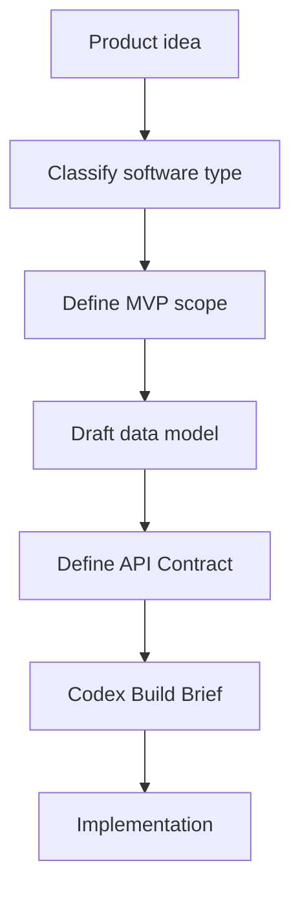

# vibe-coding-architecture-skill

Codex と AI コーディングエージェント向けの、初心者にやさしいソフトウェアアーキテクチャ相談 Skill です。

> **Architecture before implementation.**
>
> AI Coding の最初の一歩はコード生成ではなく、システムを定義することです。

> 他の言語の README:
> [中文](README.md) · [English](README.en-US.md) · [简体中文](README.zh-CN.md) · [한국어](README.ko-KR.md)

## このプロジェクトについて

`vibe-coding-architecture-skill` は、コードを書く前にプロダクトの構造を整理するための Skill / ドキュメントリポジトリです。

フレームワーク、npm パッケージ、Python パッケージ、コード生成器ではありません。

## 対象ユーザー

- Web サイト、アプリ、SaaS、AI ツール、管理画面、MVP を作りたい初心者
- アイデアはあるが技術構成を決められない個人開発者
- Codex に実装を依頼する前に要件を整理したい人
- 再利用可能なアーキテクチャ相談テンプレートを整備したいメンテナー

## 使い方

1. `SKILL.md` を読み、Skill の動作を理解します。
2. このリポジトリを Codex Skill ディレクトリにコピーするか、参考資料として使います。
3. 実装前にアーキテクチャ提案を依頼します。
4. 生成された Codex Build Brief を確認します。
5. 仕様が明確になってから実装を始めます。

## 対応するプロジェクトタイプ

- 静的サイト
- コンテンツサイト
- ログイン付き Web アプリ
- SaaS
- 管理ダッシュボード
- EC MVP
- AI ツール
- 自動化ワークフロー
- デスクトップアプリ
- モバイルアプリ
- データダッシュボード
- ブラウザ拡張
- API サービス
- Agent ワークフロー

## 出力内容

- プロダクト理解
- ソフトウェアタイプ分類
- 追加質問
- 推奨アーキテクチャ
- MVP 範囲
- データモデル案
- API Contract 案
- Mermaid 図
- リスク評価
- Codex Build Brief

## Star History

## コントリビューション

新しい例、アーキテクチャパターン、技術スタックガイド、初心者向け用語集、評価ケースの追加を歓迎します。

詳細は `docs/contribution-guide.md` を参照してください。

## License

MIT License. See `LICENSE`.
