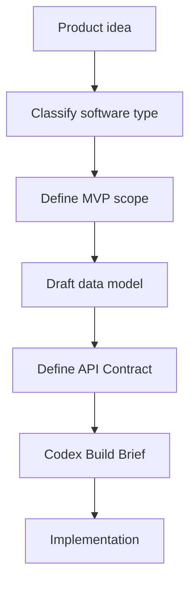

# vibe-coding-architecture-skill

Codex 및 AI 코딩 에이전트를 위한 초보자 친화적인 소프트웨어 아키텍처 조언 Skill입니다.

> **Architecture before implementation.**
>
> AI Coding의 첫 단계는 코드 생성이 아니라 시스템을 정의하는 것입니다.

> 다른 언어 README:
> [中文](README.md) · [English](README.en-US.md) · [简体中文](README.zh-CN.md) · [日本語](README.ja-JP.md)

## 이 프로젝트는 무엇인가요

`vibe-coding-architecture-skill`은 코드를 작성하기 전에 제품 구조를 명확히 정리하도록 돕는 Skill / 문서 저장소입니다.

프레임워크, npm 패키지, Python 패키지, 코드 생성기가 아닙니다.

## 누구를 위한 것인가요

- 웹사이트, 앱, SaaS, AI 도구, 대시보드, MVP를 만들고 싶은 초보자
- 아이디어는 있지만 기술 구조를 정하기 어려운 개인 개발자와 크리에이터
- Codex에 구현을 맡기기 전에 요구사항을 정리하고 싶은 사용자
- 재사용 가능한 아키텍처 상담 템플릿을 관리하고 싶은 오픈소스 기여자

## 사용 방법

1. `SKILL.md`를 읽고 Skill의 동작 방식을 이해합니다.
2. 이 저장소를 Codex Skill 디렉터리에 복사하거나 참고 저장소로 사용합니다.
3. 구현 전에 아키텍처 추천을 요청합니다.
4. 생성된 Codex Build Brief를 검토합니다.
5. 구조가 명확해진 뒤 구현을 시작합니다.

## 지원하는 프로젝트 유형

- 정적 웹사이트
- 콘텐츠 웹사이트
- 로그인 기반 Web App
- SaaS
- 관리자 대시보드
- 이커머스 MVP
- AI 도구
- 자동화 워크플로
- 데스크톱 앱
- 모바일 앱
- 데이터 대시보드
- 브라우저 확장
- API 서비스
- Agent 워크플로

## 출력 내용

- 제품 이해
- 소프트웨어 유형 분류
- 후속 질문
- 추천 아키텍처
- MVP 범위
- 데이터 모델 초안
- API Contract 초안
- Mermaid 다이어그램
- 위험 평가
- Codex Build Brief

## Star History

## 기여

새 예시, 아키텍처 패턴, 기술 스택 가이드, 초보자 용어 설명, 평가 케이스 기여를 환영합니다.

자세한 내용은 `docs/contribution-guide.md`를 참고하세요.

## License

MIT License. See `LICENSE`.
