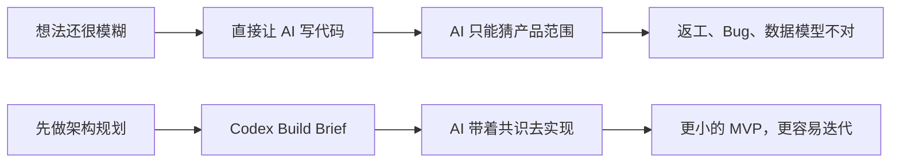
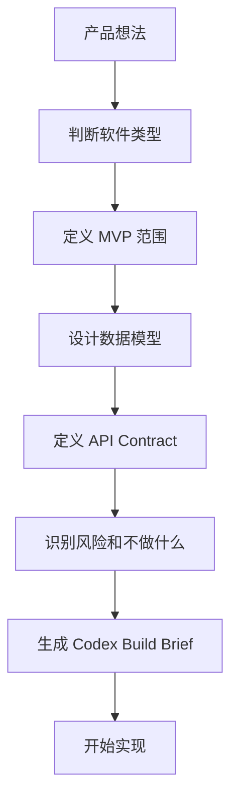

# vibe-coding-architecture-skill

[](LICENSE)
[](SKILL.md)
[](docs/usage.md)
[](https://github.com/ziguishian/vibe-coding-architecture-skill/stargazers)

一个面向普通小白的 Codex 软件架构 Skill：在写代码之前，先帮助用户用专业但通俗的方式规划软件架构。

> **先架构，后开发。**
>
> The first step of AI Coding is not generating code. The first step is defining the system.

> 其他语言 README：
> [English](README.en-US.md) · [简体中文](README.zh-CN.md) · [日本語](README.ja-JP.md) · [한국어](README.ko-KR.md)

## 这个 Skill 是什么

`vibe-coding-architecture-skill` 是一个帮助用户在 AI Coding 前做软件架构规划的 Codex Skill。

它不是软件框架，不是 npm 包，不是 Python 包，也不是代码生成器。它的作用是：在真正写代码之前，先把产品类型、MVP 范围、数据模型、API Contract、权限、部署和风险说清楚。

## 适合谁

- 想做网站、App、SaaS、AI 工具、自动化工具、后台系统或 MVP 的新手
- 有产品想法但不知道技术架构怎么选的创作者
- 想让 Codex 少走弯路、先写清楚需求的人
- 希望沉淀架构咨询模板的开源维护者

## 解决什么问题

很多 AI Coding 翻车，不是因为模型不会写代码，而是因为一开始没有定义清楚系统。

这个 Skill 会帮助你提前明确：

- 产品类型
- 目标用户
- MVP 范围
- 用户角色
- 数据模型
- 页面结构
- API Contract
- 错误状态
- 权限规则
- 文件存储
- AI 或第三方服务集成
- 部署策略
- 成本风险
- 未来升级路径

## 为什么 AI Coding 之前要先做架构

你可以理解为：写代码之前，先画清楚房子的户型图。

如果没有架构，Codex 可能会写出“能运行但不适合你的产品”的代码。先做架构，可以让后续开发更稳、更省成本，也更容易判断第一版到底该做什么。



## 先架构，后开发的流程



## 文件结构

```text
.
├── SKILL.md
├── README.md
├── README.en-US.md
├── README.zh-CN.md
├── README.ja-JP.md
├── README.ko-KR.md
├── docs/
├── references/
├── examples/
└── evals/
```

## 如何使用

1. 阅读 `SKILL.md`，了解 Skill 的触发场景和输出格式。
2. 将本仓库复制到 Codex Skill 目录，或作为普通参考仓库使用。
3. 在让 Codex 写代码前，先让它做架构规划。
4. 检查输出的 Codex Build Brief。
5. 架构清楚后，再开始实现。

## 示例触发语

```text
我想做一个 AI 文案 SaaS，先帮我规划软件架构，不要直接写代码。
```

```text
我想做一个小红书内容生成工具，帮我判断 MVP 应该怎么设计。
```

```text
我要用 Codex 做一个本地桌面端 prompt 管理器，请先做架构建议。
```

## 支持的项目类型

- 静态网站
- 内容网站
- 需要登录的 Web App
- SaaS
- 管理后台
- 电商 MVP
- AI 工具
- 自动化工作流
- 桌面应用
- 移动应用
- 数据看板
- 浏览器插件
- API 服务
- Agent 工作流
- 内部效率工具

## 不适合的场景

- 只修一个具体 bug
- 只改 UI 样式
- 只解释一个技术概念
- 只做普通文案写作
- 已经有完整架构文档，只需要实现

## 输出示例

Skill 会输出：

- 产品理解
- 软件类型判断
- 关键追问
- 推荐架构
- 小白能听懂的模块解释
- MVP 范围
- 数据模型草案
- API Contract 草案
- Mermaid 架构图
- 风险评估
- Codex Build Brief

## Star History

[](https://www.star-history.com/#ziguishian/vibe-coding-architecture-skill&Date)

## 如何贡献

欢迎补充新的案例、常见架构模式、技术栈建议、小白词汇解释和评测用例。

请阅读 `docs/contribution-guide.md`。

## License

MIT License。见 `LICENSE`。
