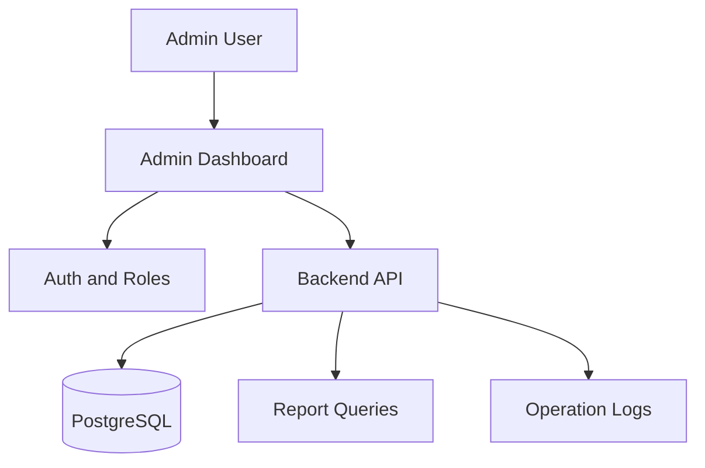

# Admin Dashboard

## User original input

I want to build an internal admin dashboard to manage customers, orders, employees, and data reports.

## How the Skill understands it

One-sentence product definition: an internal management system for structured business data.

Target users: admins, operators, managers.

Core scenario: staff logs in -> searches records -> updates entities -> checks reports.

MVP minimum loop: admin login -> view customers/orders -> edit records -> see basic report.

Possible future expansion: audit logs, approvals, exports, role hierarchy.

## Key follow-up questions

- Who can access the dashboard?
- Which entity is most important for the first version?
- Do edits need approval?
- Are reports real time or daily?
- Is data imported from another system?
- Should every change be recorded?

## Recommended architecture

Recommended architecture name: Role-based Full-stack Admin Dashboard.

Suitable stage: MVP and early commercial version.

- Frontend: React or Next.js admin UI.
- Backend: API with validation and permission checks.
- Database: PostgreSQL.
- File storage: only if attachments or exports are needed.
- Authentication: managed auth with admin roles.
- AI integration: none for MVP unless report summaries are needed.
- Deployment: internal Vercel/Railway/Render plus managed database.
- Logs and error handling: operation logs and server error logs.
- Future upgrade: audit logs, approval workflows, advanced BI.

## Mermaid diagram



## MVP scope

### Must Have

- Admin login
- Customer list and detail
- Order list and status update
- Employee list
- Basic reports

### Should Have

- Filters
- CSV export
- Operation logs

### Later

- Approval flows
- Advanced permissions
- Scheduled reports

### Do Not Build Yet

- Public user portal
- Microservices
- Complex BI warehouse

## Data model

- User: id, email, role, status
- Customer: id, name, phone, email, status
- Order: id, customer_id, amount, status, created_at
- Employee: id, name, department, role, status
- OperationLog: id, actor_id, action, target_type, target_id, created_at

Relationships:

- Customer has many Orders.
- User creates OperationLogs.

## API Contract

- `GET /api/customers`: list customers
- `GET /api/orders`: list orders with filters
- `PATCH /api/orders/:id`: update order status
- `GET /api/reports/summary`: dashboard metrics

Error format:

```json
{
  "error": {
    "code": "FORBIDDEN",
    "message": "You do not have permission."
  }
}
```

Permission requirements: admin or operator depending on action.

## Risks

| Category | Risk | Mitigation |
| --- | --- | --- |
| Product | Too many modules in MVP | Start with customers and orders |
| Technical | Slow reports | Use simple indexed queries first |
| Cost | BI tooling too early | Use database queries first |
| Model / API | Not applicable | Avoid AI in MVP |
| Data | Accidental edits | Add confirmation and operation logs |
| Permission | Wrong staff access | Define roles before coding |
| Deployment | Internal access exposure | Restrict admin routes |
| Maintenance | Schema changes break reports | Keep report queries simple |

## Codex Build Brief

### Product Goal

Build an internal admin dashboard for customers, orders, employees, and reports.

### Target Users

Admins, operators, managers.

### MVP Scope

Login, CRUD for core entities, basic reports, role checks.

### Recommended Tech Stack

Next.js, PostgreSQL, managed auth, hosted on Vercel/Railway/Render.

### Architecture Overview

Full-stack admin app with role-based backend API and structured database.

### Data Model Draft

User, Customer, Order, Employee, OperationLog.

### API Contract Draft

Customer list, order list/update, employee list, report summary.

### Pages / Screens

Login, Dashboard, Customers, Orders, Employees, Reports.

### File Structure Suggestion

`app/admin`, `app/api`, `components/tables`, `lib/auth`, `lib/db`.

### Implementation Plan

Implement auth, schema, CRUD APIs, tables, filters, reports, logs.

### Acceptance Criteria

Authorized staff can manage core records and view summary reports.

### Non-goals

Public customer portal, complex BI, approval system.

### Open Questions

Exact roles, imported data source, report definitions.
