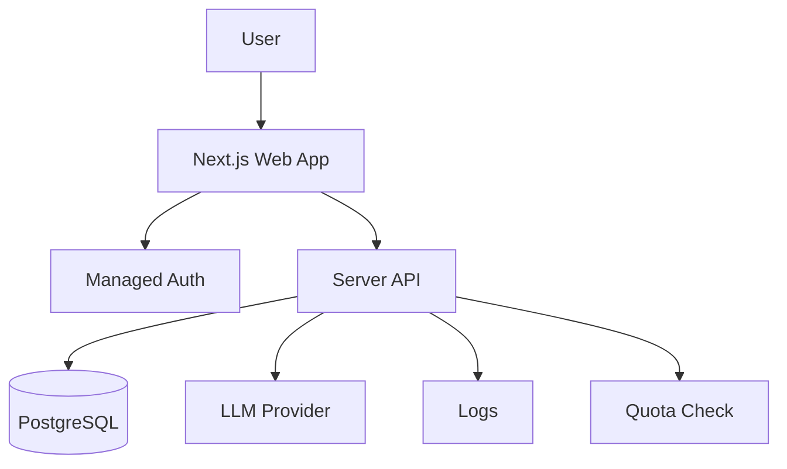

# AI SaaS MVP

## User original input

I want to build an AI copywriting SaaS with login, membership quota, LLM API calls, and generation history.

## How the Skill understands it

One-sentence product definition: a login-based AI SaaS that generates copy and records usage.

Target users: marketers, creators, small business owners.

Core scenario: user logs in -> enters brief -> AI generates copy -> user saves or reuses results.

MVP minimum loop: sign up -> generate copy -> quota decreases -> history saved.

Possible future expansion: payment, teams, templates, model routing.

## Key follow-up questions

- What copy types are supported first?
- Is payment needed in the first version?
- What is the free quota?
- Should generation stream in real time?
- Should users edit and save generated copy?
- Which LLM provider is preferred?

## Recommended architecture

Recommended architecture name: Full-stack AI SaaS MVP.

Suitable stage: MVP and early commercial version.

- Frontend: Next.js.
- Backend: Next.js API routes or server actions.
- Database: PostgreSQL via Supabase or Neon.
- File storage: not needed unless exporting files.
- Authentication: managed auth.
- AI integration: server-side LLM calls with usage tracking.
- Deployment: Vercel plus managed database.
- Logs and error handling: structured generation logs and user-facing retry messages.
- Future upgrade: billing, queue, model routing, team workspace.

## Mermaid diagram

## MVP scope

### Must Have

- Login
- Copy generation form
- Server-side LLM call
- Quota tracking
- Generation history

### Should Have

- Prompt templates
- Retry failed generation
- Basic admin view

### Later

- Payment
- Team workspace
- Multiple models

### Do Not Build Yet

- Microservices
- Complex workflow builder
- Marketplace

## Data model

- User: id, email, plan, quota_remaining, created_at
- Generation: id, user_id, input, output, model, token_usage, status, created_at
- Template: id, name, prompt, category, active

Relationships:

- User has many Generations.
- Template can be used by many Generations.

History records are needed for user value and cost review.

## API Contract

### Generate copy

- Endpoint: `/api/generations`
- Method: `POST`
- Request body: `{ "templateId": "string", "brief": "string", "tone": "string" }`
- Response body: `{ "id": "string", "status": "completed", "output": "string", "quotaRemaining": 9 }`
- Error format: `{ "error": { "code": "QUOTA_EXCEEDED", "message": "Your quota is used up." } }`
- Status flow: `pending -> processing -> completed -> failed`
- Permission requirements: logged-in user

### List history

- Endpoint: `/api/generations`
- Method: `GET`
- Response body: `{ "items": [{ "id": "string", "input": "string", "output": "string", "createdAt": "string" }] }`
- Permission requirements: logged-in user, own records only

## Risks

| Category | Risk | Mitigation |
| --- | --- | --- |
| Product | Too many writing types | Start with 2-3 templates |
| Technical | LLM latency | Show loading and retry state |
| Cost | API usage grows fast | Add quota before launch |
| Model / API | Provider outage | Store failed status and allow retry |
| Data | Sensitive prompts stored | Add privacy notice and deletion |
| Permission | Users see others' history | Enforce user_id filtering |
| Deployment | Serverless timeout | Keep prompt short, add queue later |
| Maintenance | Prompt quality drift | Version templates |

## Codex Build Brief

### Product Goal

Build an AI copywriting SaaS MVP with login, quota, generation, and history.

### Target Users

Marketers, creators, small business owners.

### MVP Scope

Login, templates, generation form, LLM call, quota tracking, history.

### Recommended Tech Stack

Next.js, PostgreSQL, managed auth, server-side LLM API, Vercel.

### Architecture Overview

Full-stack app with backend-owned AI calls and database-backed quota/history.

### Data Model Draft

User, Generation, Template.

### API Contract Draft

`POST /api/generations`, `GET /api/generations`.

### Pages / Screens

Landing, Sign in, Dashboard, Generate, History, Settings.

### File Structure Suggestion

`app`, `components`, `lib/db`, `lib/ai`, `lib/auth`, `app/api/generations`.

### Implementation Plan

Implement auth, schema, generation API, quota logic, UI pages, errors, deploy.

### Acceptance Criteria

A logged-in user can generate copy, consume quota, and view only their own history.

### Non-goals

Payment, teams, model marketplace, queue.

### Open Questions

Quota amount, provider choice, supported templates.
