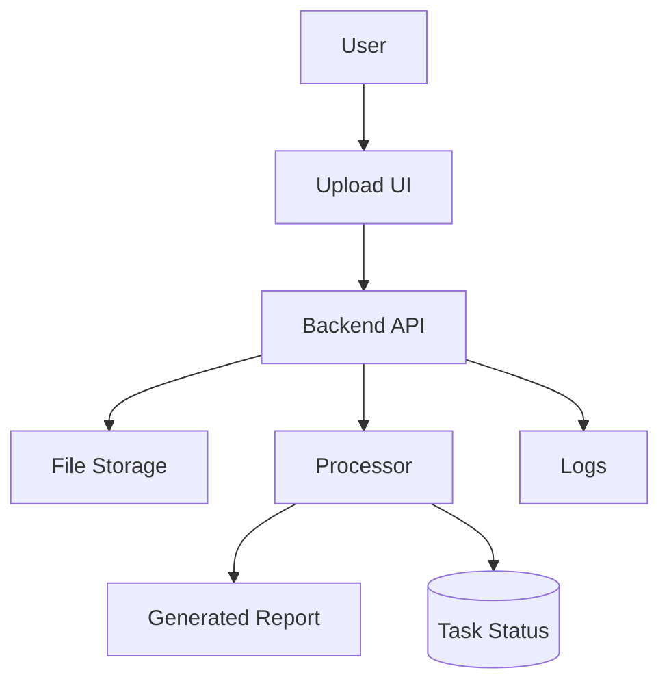

# Automation Workflow

## User original input

I want to build an automation tool that batch-processes spreadsheet content and generates reports.

## How the Skill understands it

One-sentence product definition: a batch-processing automation tool for spreadsheets and reports.

Target users: operators, analysts, founders, internal teams.

Core scenario: user uploads spreadsheet -> system processes rows -> generates report -> user downloads result.

MVP minimum loop: upload -> process -> preview status -> download report.

Possible future expansion: scheduled runs, templates, queues, webhooks.

## Key follow-up questions

- What spreadsheet columns are expected?
- What rules should be applied to each row?
- What format should the report use?
- How large are the files?
- Does processing need AI?
- Should tasks run immediately or in the background?

## Recommended architecture

Recommended architecture name: Batch Processing Web Tool.

Suitable stage: MVP.

- Frontend: simple web UI.
- Backend: API plus processing function.
- Database: optional task table.
- File storage: required for uploaded spreadsheets and generated reports.
- Authentication: optional for internal MVP, required if multi-user.
- AI integration: only if processing needs model judgment.
- Deployment: Railway/Render or serverless if files are small.
- Logs and error handling: task status and row-level error summary.
- Future upgrade: queue, scheduler, retry, webhooks.

## Mermaid diagram

## MVP scope

### Must Have

- Upload spreadsheet
- Validate columns
- Process rows
- Generate downloadable report
- Show success or failure

### Should Have

- Task history
- Row error report

### Later

- Queue
- Scheduled runs
- Webhook triggers

### Do Not Build Yet

- Visual workflow editor
- Multi-step automation marketplace

## Data model

- Task: id, status, input_file_url, output_file_url, row_count, error_count, created_at
- TaskError: id, task_id, row_number, message

File storage is needed for input and output files. History records are useful if users need to revisit reports.

## API Contract

- Endpoint: `/api/tasks`
- Method: `POST`
- Request body: multipart form with spreadsheet file
- Response body: `{ "taskId": "string", "status": "processing" }`
- Error format: `{ "error": { "code": "INVALID_COLUMNS", "message": "Missing required columns." } }`
- Status flow: `uploaded -> processing -> completed -> failed`
- Permission requirements: internal user or logged-in user

## Risks

| Category | Risk | Mitigation |
| --- | --- | --- |
| Product | Rules unclear | Define sample input/output before coding |
| Technical | Large files timeout | Use worker or queue when file size grows |
| Cost | AI processing per row is expensive | Estimate cost per file |
| Model / API | Inconsistent AI output | Use structured prompts and validation |
| Data | Sensitive spreadsheets | Store files privately and delete old files |
| Permission | Internal files exposed | Require login for shared deployment |
| Deployment | Serverless file limits | Choose container backend if needed |
| Maintenance | Format changes break import | Validate columns with clear errors |

## Codex Build Brief

### Product Goal

Build a spreadsheet automation tool that generates reports from uploaded files.

### Target Users

Operators, analysts, internal teams.

### MVP Scope

Upload, validate, process, generate report, download.

### Recommended Tech Stack

Web UI, backend processor, file storage, optional task database.

### Architecture Overview

Upload-driven batch processing with task status.

### Data Model Draft

Task and TaskError.

### API Contract Draft

`POST /api/tasks` for upload and task creation.

### Pages / Screens

Upload, Task Status, Result Download, History optional.

### File Structure Suggestion

`app`, `app/api/tasks`, `lib/processor`, `lib/storage`, `lib/db`.

### Implementation Plan

Build upload UI, validation, processor, report writer, task status, errors.

### Acceptance Criteria

A user can upload a valid spreadsheet and download a correct report.

### Non-goals

Visual workflow builder, scheduling, integrations marketplace.

### Open Questions

Spreadsheet format, report format, processing rules, file size.
