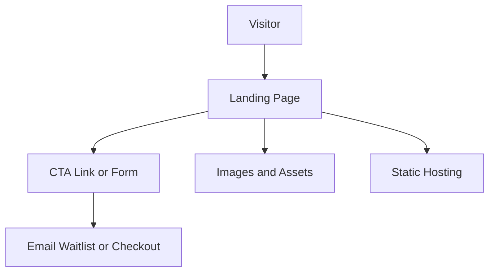

# Landing Page

## User original input

I want to quickly build a product landing page without login or database.

## How the Skill understands it

One-sentence product definition: a public static landing page for validating product interest.

Target users: potential customers, early adopters, investors.

Core scenario: visitor reads value proposition -> understands offer -> clicks CTA.

MVP minimum loop: landing page -> CTA -> contact/waitlist/payment link.

Possible future expansion: waitlist backend, analytics, A/B testing.

## Key follow-up questions

- What is the product name and one-line offer?
- What is the main CTA?
- Do you need a waitlist form?
- Who is the target customer?
- Do you need analytics?

## Recommended architecture

Recommended architecture name: Static Landing Page.

Suitable stage: Demo and MVP validation.

- Frontend: static page with responsive design.
- Backend: none unless waitlist form is required.
- Database: none.
- File storage: static assets only.
- Authentication: none.
- AI integration: none.
- Deployment: Vercel or Cloudflare Pages.
- Logs and error handling: 404 page and optional analytics.
- Future upgrade: add form backend, CMS, experiments.

## Mermaid diagram

## MVP scope

### Must Have

- Hero with clear offer
- Benefits
- Social proof or examples
- CTA
- FAQ

### Should Have

- Analytics
- Waitlist form

### Later

- A/B testing
- CMS
- Blog

### Do Not Build Yet

- Login
- Dashboard
- Database unless waitlist is needed

## Data model

No database is needed unless collecting waitlist signups.

Optional WaitlistSignup: id, email, source, created_at.

## API Contract

No API is needed if CTA links to email, checkout, or external form.

Optional:

- Endpoint: `/api/waitlist`
- Method: `POST`
- Request body: `{ "email": "string" }`
- Response body: `{ "ok": true }`
- Error format: `{ "error": { "code": "INVALID_EMAIL", "message": "Please enter a valid email." } }`
- Permission requirements: guest

## Risks

| Category | Risk | Mitigation |
| --- | --- | --- |
| Product | Message is vague | Put target user and outcome in hero |
| Technical | Overbuilt app | Keep static |
| Cost | Paid tools before validation | Use free hosting tier |
| Model / API | Not applicable | Do not add AI |
| Data | Losing leads | Use reliable form provider if needed |
| Permission | Not applicable | No login |
| Deployment | Slow page | Optimize images |
| Maintenance | Hard to change copy | Keep sections simple |

## Codex Build Brief

### Product Goal

Build a fast product landing page to validate interest.

### Target Users

Potential customers and early adopters.

### MVP Scope

Static landing page with CTA and optional waitlist.

### Recommended Tech Stack

Static HTML/React/Astro/Next.js, Vercel or Cloudflare Pages.

### Architecture Overview

Static hosting with optional form endpoint.

### Data Model Draft

No database; optional WaitlistSignup.

### API Contract Draft

No API unless waitlist is built.

### Pages / Screens

Single landing page.

### File Structure Suggestion

`src/pages`, `src/components`, `public/assets`.

### Implementation Plan

Build page sections, responsive styling, CTA, analytics, deploy.

### Acceptance Criteria

Visitor understands the offer and can complete the CTA.

### Non-goals

Login, dashboard, database, SaaS backend.

### Open Questions

Product name, CTA target, waitlist need, visual direction.
