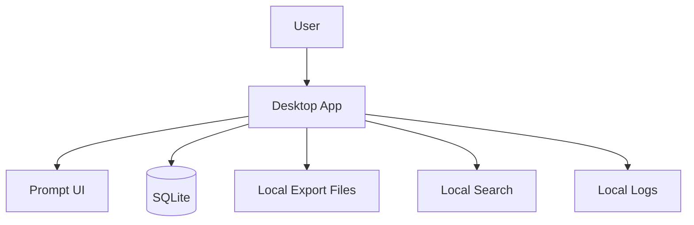

# Local Desktop App

## User original input

I want to build a local-first desktop prompt manager.

## How the Skill understands it

One-sentence product definition: a desktop app for storing, organizing, searching, and reusing prompts locally.

Target users: AI users, creators, developers, writers.

Core scenario: user saves prompt -> tags it -> searches later -> copies or edits it.

MVP minimum loop: create prompt -> search/list -> copy prompt -> edit/delete.

Possible future expansion: sync, encryption, template variables, browser extension.

## Key follow-up questions

- Should data stay only on the user's computer?
- Do prompts need tags, folders, or both?
- Is full-text search required in the first version?
- Should prompts support variables?
- Is cloud sync required now or later?

## Recommended architecture

Recommended architecture name: Local-first Desktop App.

Suitable stage: MVP.

- Frontend: Tauri or Electron UI.
- Backend: local app process.
- Database: SQLite.
- File storage: local files for export/import backups.
- Authentication: none for MVP.
- AI integration: none unless prompt improvement is added.
- Deployment: desktop app build.
- Logs and error handling: local error file and visible save errors.
- Future upgrade: optional sync, encryption, cloud backup.

## Mermaid diagram

## MVP scope

### Must Have

- Create/edit/delete prompt
- Tags or folders
- Search
- Copy to clipboard
- Import/export JSON

### Should Have

- Favorite prompts
- Keyboard shortcuts

### Later

- Cloud sync
- Encryption
- Browser extension

### Do Not Build Yet

- SaaS accounts
- Team collaboration
- Marketplace

## Data model

- Prompt: id, title, body, tags, favorite, created_at, updated_at
- Tag: id, name
- PromptTag: prompt_id, tag_id

File storage is only needed for import/export backups.

## API Contract

No network API is needed for the MVP.

Internal command contract:

- `createPrompt(input)` returns saved Prompt
- `searchPrompts(query)` returns Prompt[]
- `exportPrompts()` returns JSON file

Permission requirements: local user only.

## Risks

| Category | Risk | Mitigation |
| --- | --- | --- |
| Product | Too many organization methods | Choose tags first |
| Technical | Desktop packaging complexity | Use Tauri/Electron template |
| Cost | Cloud sync too early | Keep local-first |
| Model / API | Not applicable | Do not add AI by default |
| Data | User loses local data | Add export/import |
| Permission | Shared computer privacy | Add app lock later |
| Deployment | OS signing friction | Start with manual builds |
| Maintenance | Schema migration | Version SQLite schema |

## Codex Build Brief

### Product Goal

Build a local-first desktop prompt manager.

### Target Users

AI users, creators, developers, writers.

### MVP Scope

Local prompt CRUD, tags, search, copy, import/export.

### Recommended Tech Stack

Tauri or Electron, SQLite, local file export.

### Architecture Overview

Desktop UI with local database and no cloud backend.

### Data Model Draft

Prompt, Tag, PromptTag.

### API Contract Draft

Local commands only; no network API.

### Pages / Screens

Prompt List, Prompt Detail/Edit, Tag Filter, Settings.

### File Structure Suggestion

`src/ui`, `src/db`, `src/commands`, `src/export`.

### Implementation Plan

Create desktop shell, SQLite schema, CRUD commands, UI, search, export/import.

### Acceptance Criteria

User can save, find, edit, copy, and export prompts offline.

### Non-goals

Cloud sync, accounts, marketplace, collaboration.

### Open Questions

Tauri or Electron preference, tag vs folder, encryption needs.
