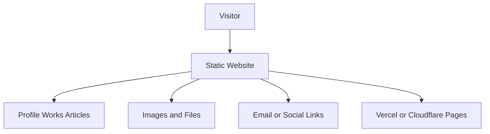

# Personal Website

## User original input

I want to build a personal website to showcase my works, articles, projects, and contact information.

## How the Skill understands it

One-sentence product definition: a public personal portfolio and content website.

Target users: visitors, potential clients, recruiters, readers.

Core scenario: visitors browse works, read articles, view projects, and contact the owner.

MVP minimum loop: visitor opens site -> understands who you are -> views work -> contacts you.

Possible future expansion: blog CMS, newsletter, analytics, search.

## Key follow-up questions

- Do you need to update articles often?
- Do you want a contact form or just email/social links?
- Do you need English, Chinese, or multiple languages?
- Are works mostly images, links, or long case studies?
- Do you need a CMS now, or is editing Markdown acceptable?

## Recommended architecture

Recommended architecture name: Static Content Website.

Suitable stage: Demo and MVP.

- Frontend: Astro or Next.js static export.
- Backend: none for MVP.
- Database: none for MVP.
- File storage: repository assets or CDN.
- Authentication: none.
- AI integration: none.
- Deployment: Vercel or Cloudflare Pages.
- Logs and error handling: hosting analytics and 404 page.
- Future upgrade: add CMS, search, and newsletter when content grows.

## Mermaid diagram

## MVP scope

### Must Have

- Home page
- Works page
- Article list and article detail
- Project page
- Contact section

### Should Have

- SEO metadata
- Responsive layout
- Basic analytics

### Later

- CMS
- Newsletter
- Search

### Do Not Build Yet

- Login
- Database
- Admin dashboard

## Data model

No database is needed for the MVP because content can be stored as Markdown/MDX files.

Core content objects:

- Article: title, date, summary, slug, body
- Project: name, summary, links, images, tags
- Work: title, description, media, result

## API Contract

No API is needed for the MVP because the site is static.

If a contact form is added later:

- Endpoint: `/api/contact`
- Method: `POST`
- Request body: `{ "name": "string", "email": "string", "message": "string" }`
- Response body: `{ "ok": true }`
- Error format: `{ "error": { "code": "INVALID_INPUT", "message": "Please check the form." } }`
- Permission requirements: guest

## Risks

| Category | Risk | Mitigation |
| --- | --- | --- |
| Product | Site does not communicate value clearly | Put positioning and best work on the first screen |
| Technical | Overbuilding with backend | Use static site first |
| Cost | Paid CMS too early | Use Markdown first |
| Model / API | Not applicable | Do not add AI |
| Data | Content organization becomes messy | Use consistent frontmatter |
| Permission | Not applicable | Avoid login |
| Deployment | Broken links | Add basic link check before release |
| Maintenance | Hard to update | Keep content files simple |

## Codex Build Brief

### Product Goal

Build a public personal website for works, articles, projects, and contact information.

### Target Users

Visitors, clients, recruiters, readers.

### MVP Scope

Static pages, Markdown articles, responsive design, contact links.

### Recommended Tech Stack

Astro or Next.js static export, Markdown/MDX, Vercel or Cloudflare Pages.

### Architecture Overview

Static site with content files and assets, no backend for MVP.

### Data Model Draft

Article, Project, Work as content files.

### API Contract Draft

No API required in MVP.

### Pages / Screens

Home, Works, Projects, Articles, Article Detail, Contact.

### File Structure Suggestion

`src/pages`, `src/content`, `src/components`, `public/assets`.

### Implementation Plan

Create layout, content collections, pages, SEO metadata, responsive styling, deploy.

### Acceptance Criteria

Visitors can understand the owner, browse work, read articles, and find contact information.

### Non-goals

Login, CMS, database, payment.

### Open Questions

Preferred visual style, languages, contact form requirement.
