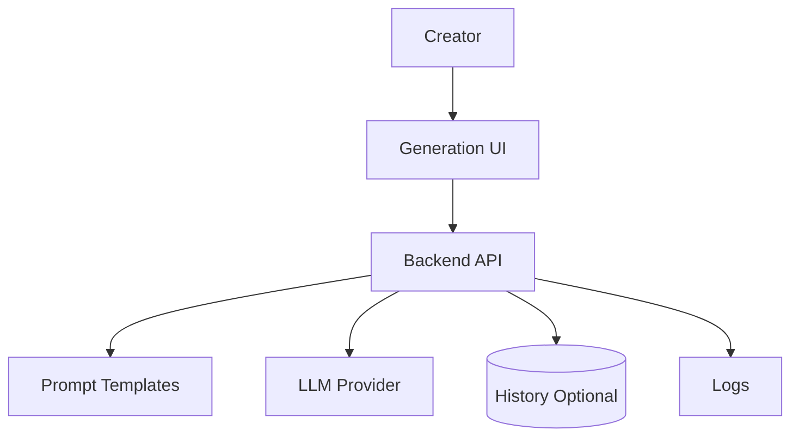

# Xiaohongshu Content Tool

## User original input

I want to build a Xiaohongshu content generation tool that takes a topic and generates titles, cover copy, carousel pages, and tags.

## How the Skill understands it

One-sentence product definition: an AI content tool for generating Xiaohongshu post materials from a topic.

Target users: creators, operators, small businesses, social media teams.

Core scenario: user enters topic -> AI generates title options, cover copy, carousel outline, body text, and tags.

MVP minimum loop: topic input -> generate content pack -> edit/copy/export.

Possible future expansion: image generation, templates, accounts, quota, team review.

## Key follow-up questions

- Is this for personal use or public SaaS?
- Should generated content be saved?
- Do you need image/carousel rendering in the first version?
- Should the tool support different tones or industries?
- Is login required?
- What LLM provider should be used?

## Recommended architecture

Recommended architecture name: AI Content Generation Web Tool.

Suitable stage: Demo and MVP.

- Frontend: Next.js generation interface.
- Backend: server-side API for prompt assembly and LLM calls.
- Database: optional for history; required if login/history is needed.
- File storage: not needed unless exporting images.
- Authentication: optional for personal tool, required for SaaS.
- AI integration: LLM API on backend.
- Deployment: Vercel plus managed database if needed.
- Logs and error handling: save failed generation reason and show retry.
- Future upgrade: image export, templates, quota, payment.

## Mermaid diagram

## MVP scope

### Must Have

- Topic input
- Title generation
- Cover copy
- Carousel page text
- Tags
- Copy/export text

### Should Have

- Tone selection
- Regenerate section
- Save history

### Later

- Carousel image rendering
- Login and quota
- Payment
- Brand voice library

### Do Not Build Yet

- Full design editor
- Multi-user collaboration
- Marketplace

## Data model

If no login/history is needed, database can be skipped for a demo.

For MVP with history:

- Generation: id, topic, tone, title_options, cover_copy, carousel_pages, tags, created_at
- User: id, email, quota_remaining, created_at

File storage is only needed later for generated carousel images.

## API Contract

- Endpoint: `/api/xhs/generate`
- Method: `POST`
- Request body: `{ "topic": "string", "tone": "practical", "audience": "string" }`
- Response body: `{ "titles": ["string"], "coverCopy": "string", "pages": [{ "page": 1, "text": "string" }], "tags": ["string"] }`
- Error format: `{ "error": { "code": "MODEL_FAILED", "message": "Generation failed. Please try again." } }`
- Status flow: `pending -> completed -> failed`
- Permission requirements: guest for demo, logged-in user for SaaS

## Risks

| Category | Risk | Mitigation |
| --- | --- | --- |
| Product | Output too generic | Use niche templates and examples |
| Technical | Prompt output format unstable | Require structured JSON output |
| Cost | Frequent regeneration | Add quota when public |
| Model / API | Model refusal or drift | Validate output and allow retry |
| Data | Storing user topics | Add deletion and privacy note |
| Permission | Public abuse | Add auth/rate limits for public launch |
| Deployment | API timeout | Keep generation concise first |
| Maintenance | Platform trends change | Update templates regularly |

## Codex Build Brief

### Product Goal

Build an AI tool that generates Xiaohongshu titles, cover copy, carousel pages, and tags from a topic.

### Target Users

Creators, operators, small businesses.

### MVP Scope

Topic input, content pack generation, copy/export, optional history.

### Recommended Tech Stack

Next.js, backend API, LLM provider, optional PostgreSQL/Supabase.

### Architecture Overview

Frontend generation UI calls backend; backend assembles prompts and calls LLM.

### Data Model Draft

Generation and optional User.

### API Contract Draft

`POST /api/xhs/generate`.

### Pages / Screens

Generate, Result, History optional, Settings optional.

### File Structure Suggestion

`app/xhs`, `app/api/xhs/generate`, `lib/prompts`, `lib/ai`.

### Implementation Plan

Build UI, prompt template, API, structured output validation, result display.

### Acceptance Criteria

User enters topic and receives usable titles, cover copy, carousel pages, and tags.

### Non-goals

Image editor, payment, teams, marketplace.

### Open Questions

Login requirement, history requirement, provider choice, target niches.
