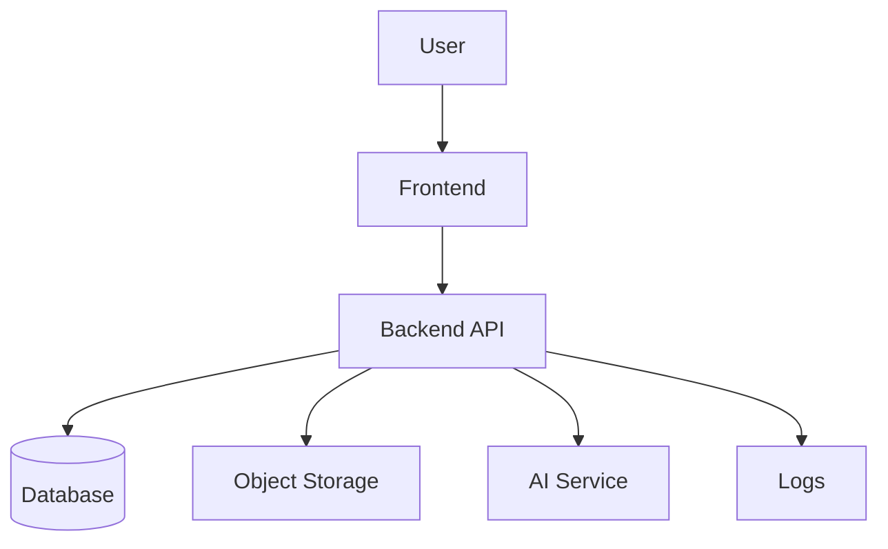

# Output Templates

## 1. Preliminary architecture recommendation template

```markdown
## 初步判断

结论：当前更像是 [软件类型]，第一版建议采用 [架构名称]。

原因：
- [原因 1]
- [原因 2]
- [原因 3]

当前阶段先不要做：
- [暂不做事项]
```

## 2. Full architecture recommendation template

```markdown
## 推荐架构

架构名称：[name]

适合阶段：[Demo / MVP / early commercial version / scalable version]

- Frontend: [choice]。原因：[why]
- Backend: [choice]。原因：[why]
- Database: [choice]。原因：[why]
- File storage: [choice]。原因：[why]
- Authentication: [choice]。原因：[why]
- AI integration: [choice]。原因：[why]
- Deployment: [choice]。原因：[why]
- Logs and errors: [choice]。原因：[why]
- Future upgrade: [path]
```

## 3. Follow-up question template

```markdown
## 还需要确认的问题

### 用户和场景
- [question]

### 核心功能
- [question]

### 数据和内容
- [question]

### 账号和权限
- [question]

### AI / 第三方服务
- [question]

### 部署和预算
- [question]

### 未来扩展
- [question]
```

## 4. Mermaid architecture diagram template



## 5. Codex Build Brief template

```markdown
# Codex Build Brief

## Product Goal

## Target Users

## MVP Scope

## Recommended Tech Stack

## Architecture Overview

## Data Model Draft

## API Contract Draft

## Pages / Screens

## File Structure Suggestion

## Implementation Plan

## Acceptance Criteria

## Non-goals

## Open Questions
```

## 6. API Contract template

````markdown
## API Contract Draft

### [Endpoint name]

- Endpoint: `/api/...`
- Method: `POST`
- Request body:

```json
{}
```

- Response body:

```json
{}
```

- Error format:

```json
{
  "error": {
    "code": "STRING_CODE",
    "message": "Human-readable message"
  }
}
```

- Status flow: [pending -> processing -> completed -> failed]
- Permission requirements: [guest / logged-in user / admin]
````

## 7. Data Model Draft template

```markdown
## Data Model Draft

### Entity: [Name]

- `id`: unique identifier
- `created_at`: creation time
- `updated_at`: update time
- `[field]`: [meaning]

Relationships:
- [Entity A] has many [Entity B]

Lifecycle:
- created when [event]
- updated when [event]
- deleted or archived when [event]
```

## 8. MVP Scope template

```markdown
## MVP Scope

### Must Have
- [feature]

### Should Have
- [feature]

### Later
- [feature]

### Do Not Build Yet
- [feature]
```

## 9. Risk assessment template

```markdown
## Risks

| Category | Risk | Mitigation |
| --- | --- | --- |
| Product | [risk] | [mitigation] |
| Technical | [risk] | [mitigation] |
| Cost | [risk] | [mitigation] |
| Model / API | [risk] | [mitigation] |
| Data | [risk] | [mitigation] |
| Permission | [risk] | [mitigation] |
| Deployment | [risk] | [mitigation] |
| Maintenance | [risk] | [mitigation] |
```
